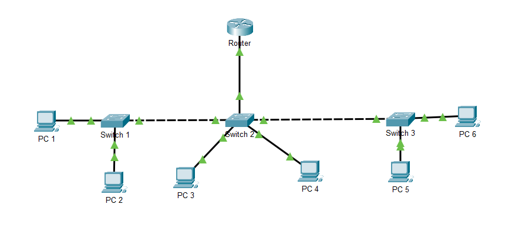
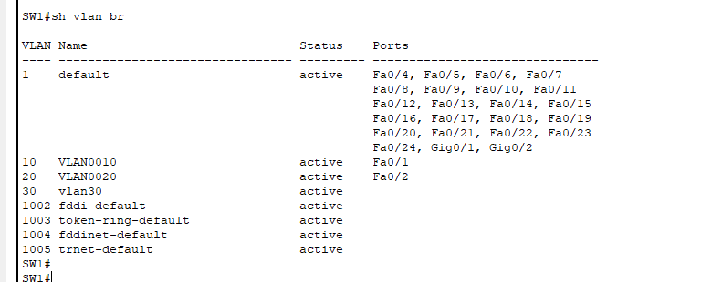
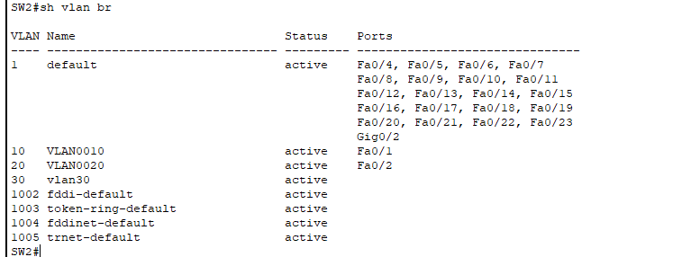
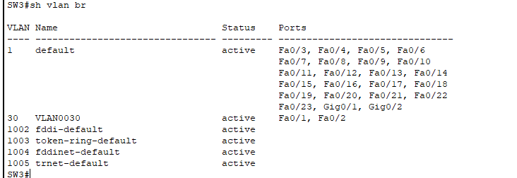
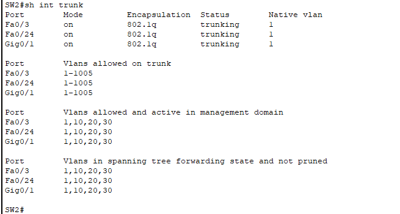
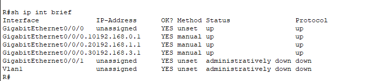
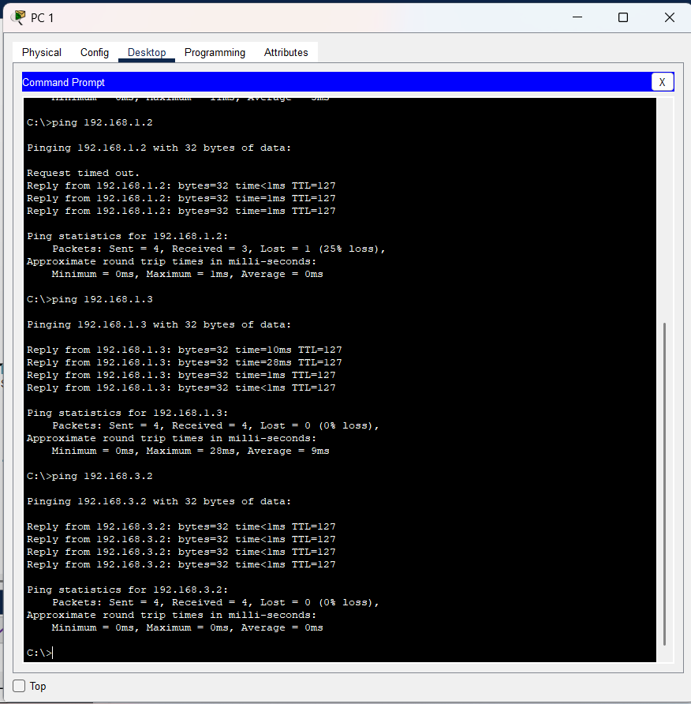

# Router-on-a-Stick Multi-Switch VLAN Lab
## Project Overview
This project demonstrates the implementation of Router-on-a-Stick (ROAS) using one router and three Layer 2 switches. VLANs were created to segment the network, trunk links were configured to carry VLAN traffic between devices, and inter-VLAN communication was enabled using router subinterfaces with IEEE 802.1Q encapsulation.

## Network Topology


## VLAN Design
| VLAN ID | VLAN Name | Devices  |
| ------- | --------- | -------- |
| 10      | Vlan 10   | PC1, PC3 |
| 20      | Van 20    | PC2, PC4 |
| 30      | Vlan 30   | PC5, PC6 |

---

## IP Addressing Scheme

| VLAN    | Network Address | Default Gateway |
| ------- | --------------- | --------------- |
| VLAN 10 | 192.168.0.0/24  | 192.168.0.1     |
| VLAN 20 | 192.168.1.0/24  | 192.168.1.1     |
| VLAN 30 | 192.168.3.0/24  | 192.168.3.1     |

### End Device Addressing

| Device | VLAN | IP Address    |
| ------ | ---- | ------------- |
| PC1    | 10   | 192.168.0.2   |
| PC3    | 10   | 192.168.0.3   |
| PC2    | 20   | 192.168.1.2   |
| PC4    | 20   | 192.168.1.3   |
| PC5    | 30   | 192.168.3.2   |
| PC6    | 30   | 192.168.3.3   |

Subnet Mask: 255.255.255.0

## Router Configuration
### Router Subinterfaces

| Interface | VLAN | IP Address   |
| --------- | ---- | ------------ |
| G0/0.10   | 10   | 192.168.0.1  |
| G0/0.20   | 20   | 192.168.1.1  |
| G0/0.30   | 30   | 192.168.3.1  |

Encapsulation Method: IEEE 802.1Q

## Trunk Configuration

| Link              | Mode  |
| ----------------- | ----- |
| Switch1 ↔ Switch2 | Trunk |
| Switch2 ↔ Switch3 | Trunk |
| Switch2 ↔ Router  | Trunk |

## Verification
### VLAN Verification
#### Switch 1

#### Switch 2

#### Switch 3


### Trunk Verification



### Router Subinterface Verification



### Connectivity Verification



---

## Cisco IOS Verification Commands

```bash
show vlan brief
show interfaces trunk
show ip interface brief
show running-config
```

## Concepts Demonstrated

* VLAN Creation and Management
* Access Port Configuration
* IEEE 802.1Q Trunking
* Router-on-a-Stick Configuration
* Inter-VLAN Routing
* Multi-Switch Network Design
* End-to-End Connectivity Testing
* Cisco IOS Verification and Troubleshooting

---

## Project Outcome

Successfully implemented a multi-switch VLAN network with Router-on-a-Stick inter-VLAN routing. Devices in VLAN 10, VLAN 20, and VLAN 30 were able to communicate through router subinterfaces while maintaining logical network segmentation.
